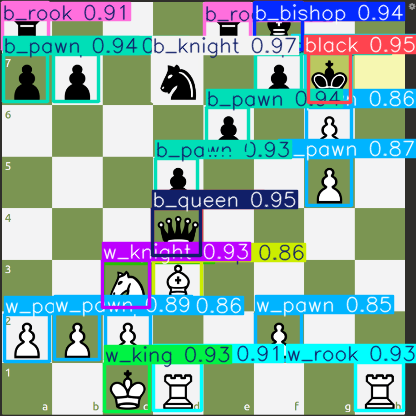

# Chess Automation Robot

A program that detects chess pieces via screen capture, calculates optimal moves using open-source stockfish, and automates mouse movements to play chess. Designed as a foundation for a future physical chess-playing robot trainer.

 

## Overview
- **Screen Scanning**: Uses YOLOv11 model to detect chess pieces in real-time
- **Board Detection**: Automatically crops chessboard using corner detection
- **Coordinate Mapping**: Converts screen coordinates to chess notation (a1-h8)
- **AI Integration**: Utilizes Stockfish engine for move calculation
- **Mouse Automation**: Physically moves pieces via programmatic mouse control

## Program Structure
### Core Components
1. **YOLOv10 Model** ([Dataset](https://universe.roboflow.com/peter-bui/chess-piece-object-detection-tdpqo)) 
   - Trained on 416x416 images
   - Real-time piece detection with bounding boxes
   
2. **Chessboard Processing**
   - `chess_fen_utils` for chess board detection through detecting 4 largest corners
   - Dynamic coordinate mapping between pixels and chess notation
3. **FEN Generation**
   - Creates Forsyth-Edwards Notation from detected positions
   - Integrated with `python-chess` library for board management and validation
4. **AI Move Calculation**
   - Stockfish integration for optimal move suggestions
   - Automatic mouse movement execution

## Video Demo
<video width="640" height="360" controls>
  <source src="https://Buiilding.github.io/chess-automation/src/images/Ches-demo-crop.mp4" type="video/mp4">
  Your browser does not support the video tag.
</video>

## Installation

### Prerequisites
- Windows/Linux
- Python 3.9
- Anaconda (optional)
### Setup
1. Clone repository:
   ```bash
   git clone https://github.com/Buiilding/chess-automation.git
   cd chess-automation
   cd src
2. Create new conda environment:
    ```bash
    conda create -n chess-voice-main python==3.9 -y
    conda activate chess-voice-main
3. Install requirements
    ```bash
    pip install -r requirements.txt
### Usage
1. Go to chess.com
    - Go to "play bots" (do not play with humans if you don't want to get banned)
    - Choose a bot 
    - The program works best with **Cases** Pieces and **8-Bit** Board (can be modified in settings)
1. Run main.py
    ```bash
    python main.py
2. Select screen
    - If you have dual screen, place the terminal in another screen
    - Leave the chess board you want to automate to another screen
    - Type the screen number you want the program to scan
3. Visualisation (Optional)
    - If you want to see the detected bounding boxes of the pieces
    - Uncomment the following line in main.py
    ```bash
    cv2.imshow("lmao", predicted_img)
### Key Features
- Real-time board state detection
- Adaptive to different chess sets/board
- Detects move-turn through the opaque yellowish color everytime a piece is moved in chess.com
- Continuous play capability (doesn't need to start from the begginning position)
- Physical move execution via mouse control 

### Notes
The reason I want to do this project is that one of my life dreams is to create robots that can do human tasks seamlessly. This is not a novel way to cheat in chess.com, rather a way to show how far technology has come and evidence to show that robots can also be capable of what humans can do. Continuing this, I will make technology that assists the world in repetitive tasks that do not require major brainpower. Achieveing this, humans will be able to allocate more time on what is important, such as family, personal connections, artistic passions, endeavors that technology can never ever replicate.

